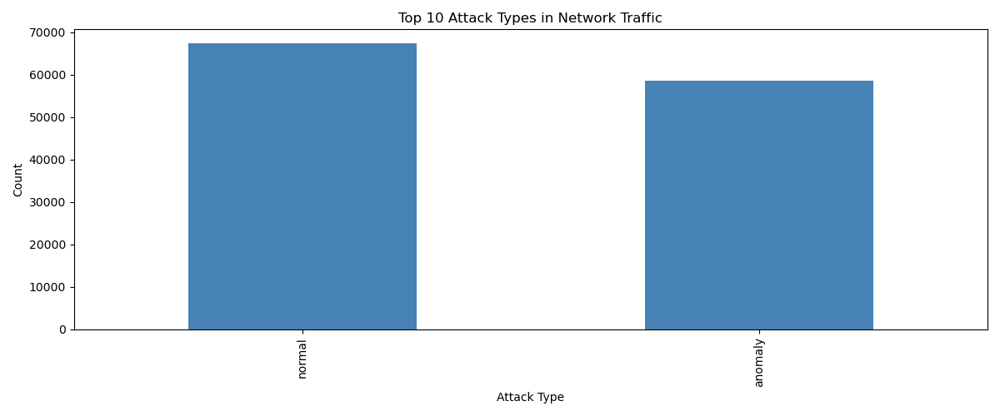
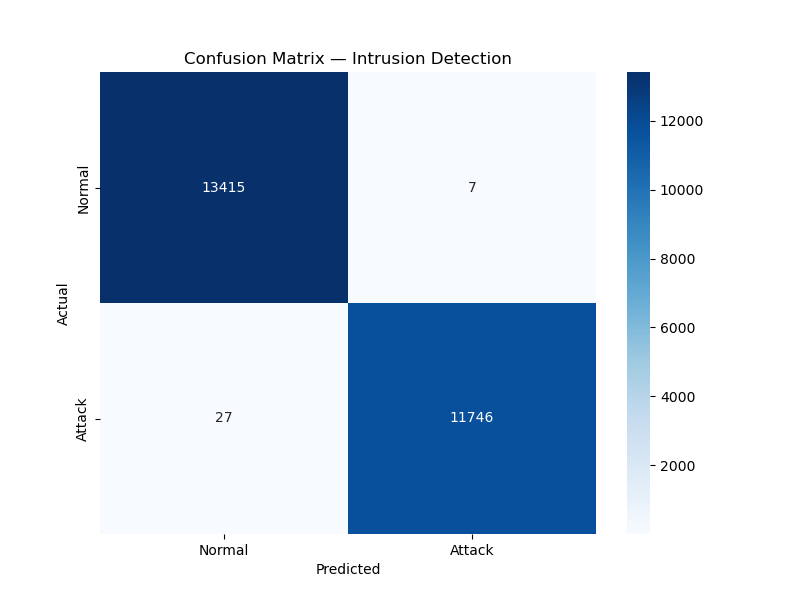
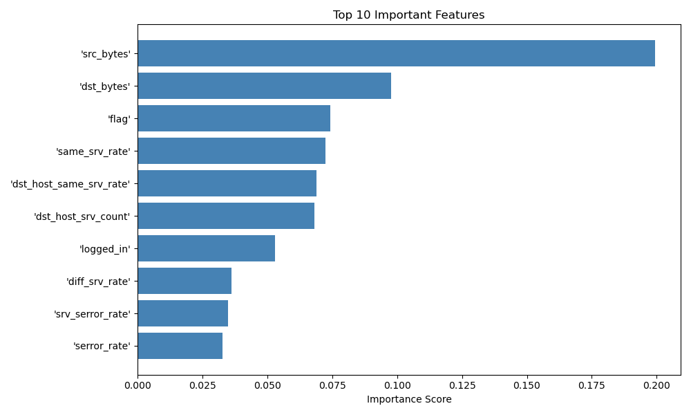

# intrusion-detection-ml
Overview
A Machine Learning model that detects cyberattacks 
in network traffic. Built on the NSL-KDD benchmark 
dataset using Random Forest algorithm.
 Results
 Model, Accuracy 
 Random Forest, 99.87% 
 Visualizations

 Tech Stack
 Python
 Scikit-learn, Pandas, NumPy
 Matplotlib, Seaborn
 Dataset
NSL-KDD — standard benchmark dataset for 
network intrusion detection research
 How to Run
1. Clone this repository
2. Install requirements: pip install -r requirements.txt
3. Open 01_EDA.ipynb
4. Run 02_Model.ipynb

